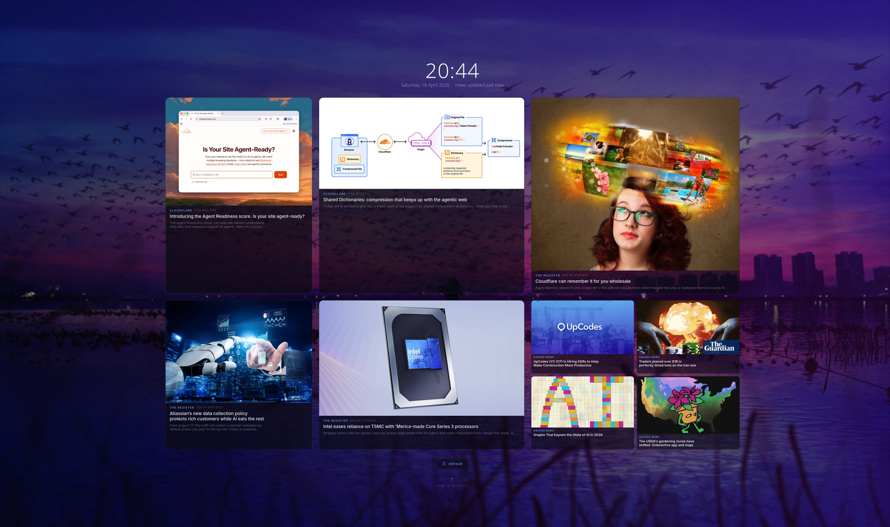

# news-screensaver

A news screensaver for Hyprland (Wayland) that displays live tech and cyber security news as an interactive overlay on your desktop wallpaper.



## Features

- **Live news cards** -- fetches headlines from configurable RSS feeds and displays them as interactive cards
- **Wallpaper background** -- your desktop wallpaper shows through with a subtle dark tint
- **Click to read** -- cards expand in-place to show the full article text with a scrollable body
- **4x4 mini-grid** -- extra headlines with thumbnails shown in a compact grid in the corner
- **Open in browser** -- click to open the full article in your default browser
- **Slide-in animation** from top with staggered card fade-in
- **Drag up to dismiss** with rubber-band physics
- **Keyboard toggle** -- press once to open, press again to close
- **Idle activation** -- appears automatically after 7 minutes of inactivity via hypridle
- **Background cache** -- articles and images are cached to disk and updated every 30 minutes by a systemd timer
- **Instant launch** -- loads entirely from cache with zero network delay
- **Smart sorting** -- articles with readable text are shown as main cards; browser-only articles go to the mini-grid
- **Auto-refresh** -- silently updates content if left open for 30+ minutes
- **Cache age indicator** -- shows when the news was last updated

## How it works

The screensaver is split into two parts:

### 1. Cache updater (`news-cache-updater`)

A standalone Python script that runs in the background via a systemd timer (every 30 minutes). It:

1. Fetches RSS feeds from all configured sources in parallel
2. Extracts article text from the RSS content, and for items with short or missing text, fetches the full article from the web
3. Downloads thumbnail images from RSS `media:thumbnail` tags, or falls back to `og:image` / `twitter:image` from the article page
4. Pre-scales all images to card size (800x400) for fast loading
5. Sorts articles: items with good readable text go first (main cards), items without text go last (mini-grid, browser-only)
6. Saves everything to `~/.cache/news-screensaver/cache.json` along with the pre-scaled images
7. Cleans up stale image files from previous runs

### 2. Screensaver (`news-screensaver`)

A GTK4 + gtk4-layer-shell application that creates a fullscreen Wayland overlay. On launch it:

1. Reads the cached JSON file -- no network calls, instant
2. Loads your wallpaper (detected from pywal or `~/Pictures/Wallpapers/`) as the background with a dark tint
3. Builds the card layout and decodes images in a background thread
4. Slides in from the top with an ease-out animation
5. Fades in each card one by one with a staggered delay

When you click a card, it expands in-place: the other cards fade out, the clicked card widens to full grid width, and the article body appears in a scrollable area below. Press Esc, Enter, or click "back to news" to collapse back.

The `news-toggle` wrapper script handles toggling: if the screensaver is running it kills it, otherwise it launches it with the required `LD_PRELOAD` for gtk4-layer-shell.

## Requirements

- Arch Linux (or any distro with the packages below)
- Hyprland
- Python 3
- GTK4
- gtk4-layer-shell
- python-gobject
- python-feedparser
- python-requests

### Optional

- hypridle (for automatic idle activation)
- python-pillow (for faster image scaling in the cache updater)

## Install

```bash
git clone https://github.com/new-testament/news-screensaver.git
cd news-screensaver
./install.sh
```

The install script will:
- Check and install dependencies via pacman
- Copy scripts to `~/.local/bin/`
- Set up the systemd timer for background cache updates
- Build the initial cache

## Usage

### Manual toggle

```bash
news-toggle
```

### Hyprland keybind

Add to your Hyprland binds config:

```
bindl = $mainMod, escape, exec, ~/.local/bin/news-toggle
```

### Auto-activate on idle

Install hypridle and copy the example config:

```bash
sudo pacman -S hypridle
cp hypridle.conf.example ~/.config/hypr/hypridle.conf
```

Add `hypridle` to your Hyprland `startup.conf`:

```
exec-once = hypridle
```

The screensaver will appear after 7 minutes of inactivity. It stays open until you dismiss it (drag up, Esc, or toggle keybind) -- moving the mouse won't close it, so you can browse the articles.

### Controls

| Action | Effect |
|--------|--------|
| Click a card | Expand to read the article |
| Esc / Enter | Go back to news grid (or close if on the main screen) |
| Drag up | Dismiss the screensaver |
| Alt+Escape | Toggle on/off (configurable) |
| Click "open in browser" | Opens article in browser and closes the screensaver |
| Click "refresh" | Force-fetch fresh news |

## Configuring news sources

Edit the `RSS_FEEDS` list in **both** `news-screensaver` and `news-cache-updater`. Each entry is a tuple of `(display name, RSS feed URL, max items to fetch)`:

```python
RSS_FEEDS = [
    ("Cloudflare", "https://blog.cloudflare.com/rss/", 2),
    ("The Register", "https://www.theregister.com/headlines.atom", 3),
    ("Hacker News", "https://hnrss.org/frontpage", 4),
    ("BBC London", "https://feeds.bbci.co.uk/news/england/london/rss.xml", 3),
    ("Dark Reading", "https://www.darkreading.com/rss.xml", 2),
    ("Krebs on Security", "https://krebsonsecurity.com/feed/", 2),
    ("Ars Technica", "https://feeds.arstechnica.com/arstechnica/index", 2),
]
```

To add a new source, append a new tuple. To remove one, delete the line. The total number of items fetched should be at least 9 (5 main cards + 4 mini-grid).

### Finding RSS feeds

Most news sites have an RSS feed. Common patterns:
- `/rss`, `/feed`, `/rss.xml`, `/atom.xml`
- Check the page source for `<link rel="alternate" type="application/rss+xml">`
- Use [RSS Bridge](https://rss-bridge.org/) for sites without native feeds

### Examples

```python
# cyber security
("BleepingComputer", "https://www.bleepingcomputer.com/feed/", 3),
("Schneier on Security", "https://www.schneier.com/feed/atom/", 2),
("Threatpost", "https://threatpost.com/feed/", 2),

# general tech
("TechCrunch", "https://techcrunch.com/feed/", 3),
("Wired", "https://www.wired.com/feed/rss", 2),
("The Verge", "https://www.theverge.com/rss/index.xml", 3),

# london / UK
("BBC Technology", "https://feeds.bbci.co.uk/news/technology/rss.xml", 3),
("The Guardian Tech", "https://www.theguardian.com/uk/technology/rss", 2),
("Evening Standard", "https://www.standard.co.uk/rss", 2),

# developer
("Dev.to", "https://dev.to/feed", 3),
("Lobsters", "https://lobste.rs/rss", 3),
("Mozilla Hacks", "https://hacks.mozilla.org/feed/", 2),
```

After editing, rebuild the cache:

```bash
news-cache-updater
```

## File locations

| File | Purpose |
|------|---------|
| `~/.local/bin/news-screensaver` | Main screensaver application |
| `~/.local/bin/news-cache-updater` | Background cache updater |
| `~/.local/bin/news-toggle` | Toggle script for keybinds |
| `~/.cache/news-screensaver/cache.json` | Cached articles and metadata |
| `~/.cache/news-screensaver/images/` | Pre-scaled cached images |
| `~/.cache/news-screensaver/wallpaper-bg.jpg` | Scaled wallpaper cache |
| `~/.config/systemd/user/news-cache.timer` | Systemd timer (every 30 min) |

## Troubleshooting

**Screensaver opens as a regular window, not fullscreen overlay:**
The `news-toggle` script sets `LD_PRELOAD` for gtk4-layer-shell. If launching directly, use:
```bash
LD_PRELOAD=/usr/lib/libgtk4-layer-shell.so news-screensaver
```

**Images not loading:**
Run `news-cache-updater` manually and check the output. Some sites block image downloads or don't provide `og:image` tags.

**Cache not updating:**
Check the systemd timer: `systemctl --user status news-cache.timer`

**Wallpaper not detected:**
The screensaver looks for your wallpaper in `~/.cache/wal/wal` (pywal) or `~/Pictures/Wallpapers/`. Edit the `_find_wallpaper` method in `news-screensaver` to match your setup.

## Licence

MIT
